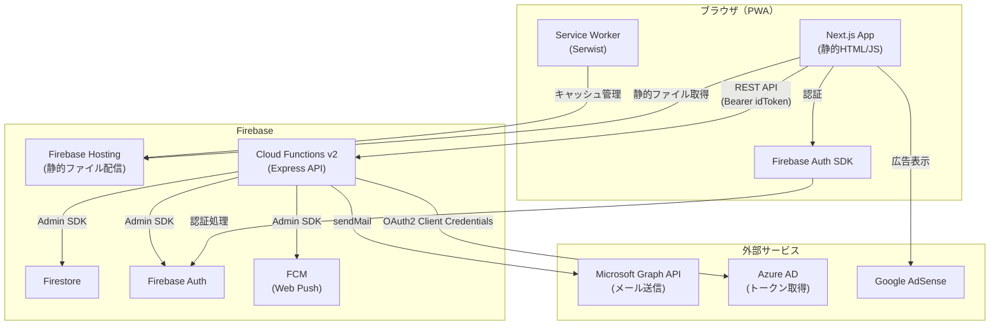
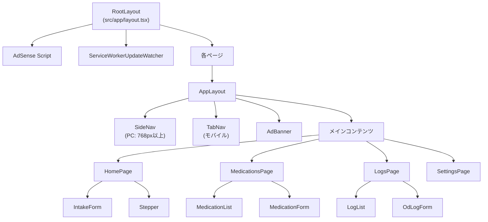
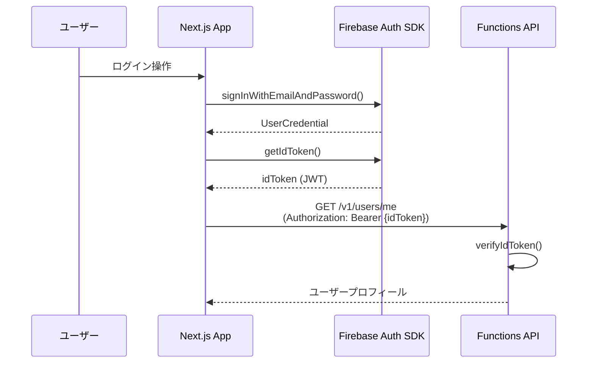
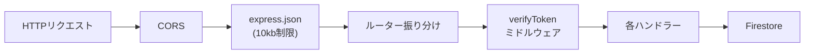
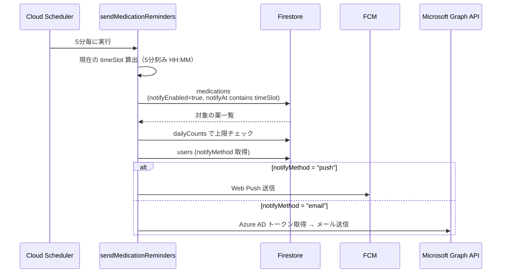
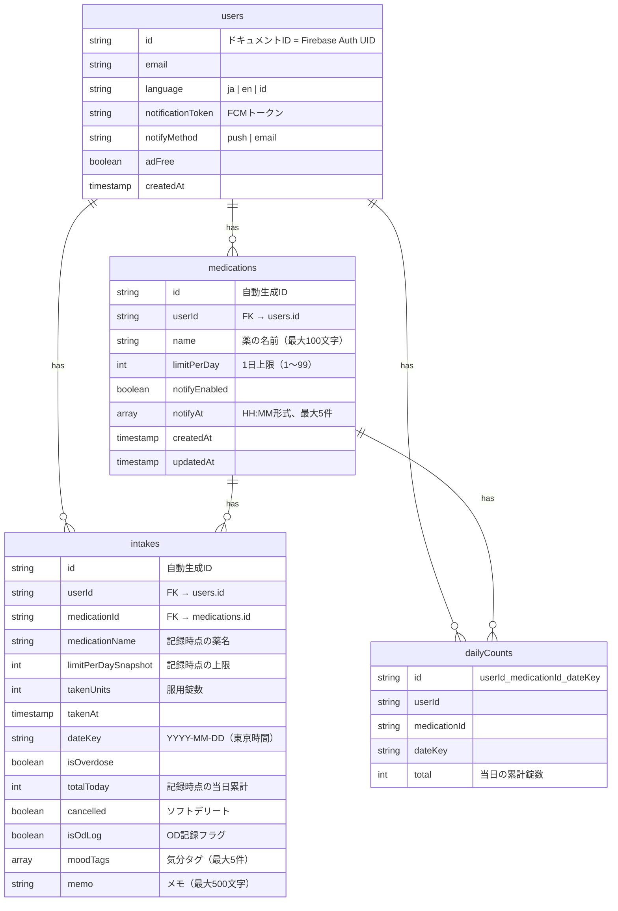
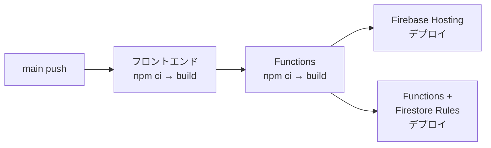

# アーキテクチャ

ObatLog のシステムアーキテクチャドキュメント。コードから読み取った事実に基づく。

---

## 1. 全体構成図



---

## 2. フロントエンド

### 2.1 Next.js App Router + SSG

- `next.config.mjs` で `output: 'export'` を設定し、完全な静的エクスポートを行う
- `trailingSlash: true` で `/medications/` のようなパス生成
- ビルド成果物は `out/` ディレクトリに出力され、Firebase Hosting で配信
- `firebase.json` のリライトルール `"source": "**" → "/index.html"` でクライアントサイドルーティングに対応

### 2.2 ページ一覧

| パス | ファイル | 役割 |
|------|----------|------|
| `/` | `src/app/page.tsx` | ホーム画面（未ログイン: ランディング / ログイン済: 服薬記録） |
| `/login` | `src/app/login/page.tsx` | ログインフォーム |
| `/medications` | `src/app/medications/page.tsx` | 薬の一覧・登録・編集・削除 |
| `/logs` | `src/app/logs/page.tsx` | 服薬ログ一覧（直近30件、日付グルーピング） |
| `/settings` | `src/app/settings/page.tsx` | 設定画面（言語・通知方法・アカウント管理） |
| `/privacy` | `src/app/privacy/page.tsx` | プライバシーポリシー |
| `/terms` | `src/app/terms/page.tsx` | 利用規約 |

全ページは `'use client'` ディレクティブを使用し、クライアントサイドで動作する。

### 2.3 コンポーネント構成



**レスポンシブ設計:**
- モバイル（768px未満）: 下部に `TabNav` + 最下部に `AdBanner`（固定配置）
- PC（768px以上）: 左側に `SideNav`（幅 224px 固定）+ 今日の服薬サマリー表示

**主要コンポーネント:**

| コンポーネント | 役割 |
|--------------|------|
| `AppLayout` | レスポンシブ判定・ナビゲーション切替・広告フラグ取得 |
| `TabNav` | モバイル用下部タブ（ホーム・薬・ログ・設定） |
| `SideNav` | PC用サイドバー + 今日の服薬プログレスバー |
| `HomePage` | ログイン判定 → ランディング or 服薬記録画面 |
| `IntakeForm` | 薬選択 + 錠数入力（Stepper）で服薬記録 |
| `MedicationForm` | 薬の名前・上限・通知設定の入力フォーム |
| `LogList` | 服薬履歴の一覧表示（日付グルーピング） |
| `OdLogForm` | OD記録用フォーム（気分タグ + メモ） |
| `ErrorBoundary` | エラー境界 |
| `LangSwitcher` | 言語切替（日本語・英語・インドネシア語） |
| `AdBanner` | Google AdSense 広告バナー |
| `ProgressBar` | 服薬進捗バー（SideNav 内で使用） |
| `Toast` | 通知トースト |

### 2.4 認証フロー



- `src/lib/firebase.ts` で Firebase App と Auth を初期化（多重初期化防止済み）
- 各コンポーネントで `onAuthStateChanged` を使って認証状態を監視
- 未認証時は `/login` へリダイレクト

### 2.5 API 通信パターン

`src/lib/api.ts` の `apiFetch<T>()` が全 API 呼び出しの共通ラッパー:

1. `auth.currentUser.getIdToken()` で最新の idToken を取得
2. `NEXT_PUBLIC_FUNCTIONS_BASE_URL` をベースに `fetch()` を実行
3. `Authorization: Bearer {token}` ヘッダーを自動付与
4. エラー時は `ApiError` クラス（status, code, message）をスロー
5. 204 レスポンスは `undefined` として返却

**API クライアントモジュール:**

| ファイル | 提供する関数 |
|----------|------------|
| `src/api/users.ts` | `getMe()`, `updateMe()` |
| `src/api/medications.ts` | `listMedications()`, `createMedication()`, `updateMedication()`, `deleteMedication()` |
| `src/api/intakes.ts` | `listIntakesByDate()`, `listRecentIntakes()`, `createIntake()`, `cancelIntake()` |

### 2.6 PWA（Serwist）

- `@serwist/next` を使用し、`src/app/sw.ts` から `public/sw.js` を生成
- 開発環境（`NODE_ENV === 'development'`）では無効化
- `ServiceWorkerUpdateWatcher` コンポーネントが SW の更新を監視
- `manifest.json` によるホーム画面追加対応

---

## 3. バックエンド（Firebase Functions）

### 3.1 Express アプリ構成



- `functions/src/index.ts` で Express アプリを構成
- `onRequest()` で Functions v2 としてエクスポート（リージョン: `asia-northeast1`）
- タイムアウト: 60秒

**CORS 許可オリジン:**
- `https://obatlog.web.app`
- `https://obatlog.firebaseapp.com`
- `https://obatlog.osaka29.jp`
- `http://localhost:4321`（開発）
- `http://localhost:5000`（開発）

### 3.2 認証ミドルウェア

`functions/src/middleware/auth.ts` の `verifyToken`:

- `Authorization: Bearer {token}` ヘッダーから idToken を抽出
- `admin.auth().verifyIdToken()` で検証
- 成功時: リクエストオブジェクトに `uid` と `email` を付与
- 失敗時: 401 エラーを返却
- 全 API エンドポイントで使用

### 3.3 エンドポイント一覧

#### ユーザー（`/v1/users`）

| メソッド | パス | 処理 | ファイル |
|---------|------|------|----------|
| GET | `/v1/users/me` | プロフィール取得（初回は自動生成） | `users.ts` |
| PUT | `/v1/users/me` | language / notificationToken / notifyMethod 更新 | `users.ts` |
| DELETE | `/v1/users/me` | アカウントと全データを削除 | `accountDelete.ts` |
| GET | `/v1/users/me/export` | ユーザーデータ一括エクスポート（JSON） | `dataExport.ts` |

#### 薬（`/v1/medications`）

| メソッド | パス | 処理 | ファイル |
|---------|------|------|----------|
| GET | `/v1/medications` | ユーザーの薬一覧取得 | `medications.ts` |
| POST | `/v1/medications` | 薬を登録 | `medications.ts` |
| PUT | `/v1/medications/:id` | 薬を更新（名前・上限・通知設定） | `medications.ts` |
| DELETE | `/v1/medications/:id` | 薬をハード削除 | `medications.ts` |

#### 服薬記録（`/v1/intakes`）

| メソッド | パス | 処理 | ファイル |
|---------|------|------|----------|
| GET | `/v1/intakes` | 記録取得（`?dateKey=` で日別 / `?limit=` で直近N件） | `intakes.ts` |
| POST | `/v1/intakes` | 服薬記録（過量チェック含む・超過でも保存） | `intakes.ts` |
| PATCH | `/v1/intakes/:id` | 記録取り消し（ソフトデリート + dailyCounts 減算） | `intakes.ts` |

### 3.4 過量チェックロジック

`intakes.ts` の `calcOverdose()`:

```
totalToday = previousTotal + takenUnits
isOverdose = totalToday > limitPerDay
```

- 通常記録: Firestore トランザクションで `dailyCounts` を原子更新し、過量判定
- OD記録（`isOdLog: true`）: `dailyCounts` には加算せず、常に `isOverdose: true`
- 取り消し時: トランザクションで `dailyCounts` を減算（OD記録は減算なし）

### 3.5 Scheduled Function（通知）

`functions/src/notify.ts` の `sendMedicationReminders`:

- **スケジュール**: 5分毎（`*/5 * * * *`）、東京タイムゾーン
- **リージョン**: `asia-northeast1`
- **シークレット**: `AZURE_TENANT_ID`, `AZURE_CLIENT_ID`, `AZURE_CLIENT_SECRET`

**処理フロー:**



- `reminderSlot.ts`: 現在時刻を東京タイムゾーンの5分刻みスロット（`HH:MM`）に変換
- `mailSender.ts`: Azure AD Client Credentials フローでアクセストークン取得 → Graph API `/sendMail` でメール送信（トークンキャッシュ + 401時リトライ）
- `mailTemplate.ts`: リマインダーメールのHTMLテンプレート生成
- 上限に達した薬は通知対象から除外

---

## 4. データモデル

### Firestore コレクション

サブコレクションは使用しない。全コレクションはフラット構造。



### dailyCounts の ID 規則

`{userId}_{medicationId}_{dateKey}` — ユーザー×薬×日付でユニークなカウンター。トランザクションで原子更新する。

---

## 5. セキュリティ

### 5.1 Firestore ルール

```
rules_version = '2';
service cloud.firestore {
  match /databases/{database}/documents {
    match /{document=**} {
      allow read, write: if false;
    }
  }
}
```

**クライアントからの直接アクセスは全て拒否。** 全データ操作は Firebase Functions の Admin SDK 経由でのみ行う。

### 5.2 API 認証

- 全エンドポイントで `verifyToken` ミドルウェアを適用
- `admin.auth().verifyIdToken()` による Firebase ID トークンの検証
- 各ハンドラー内で `userId` の一致チェック（他ユーザーのデータへのアクセス防止）

### 5.3 入力バリデーション

| 対象 | 制限 |
|------|------|
| 薬の名前 | 最大100文字、空文字不可 |
| limitPerDay | 1〜99の整数 |
| takenUnits | 通常: 1〜99 / OD記録: 1〜999 |
| notifyAt | HH:MM形式、最大5件 |
| moodTags | 最大5件、各最大50文字 |
| memo | 最大500文字 |
| リクエストボディ | 10KB制限（`express.json`） |

### 5.4 HTTP セキュリティヘッダー

`firebase.json` で全レスポンスに付与:

- `X-Content-Type-Options: nosniff`
- `X-Frame-Options: DENY`
- `Referrer-Policy: strict-origin-when-cross-origin`
- `Permissions-Policy: camera=(), microphone=(), geolocation=()`

---

## 6. デプロイ

### 6.1 CI（`.github/workflows/ci.yml`）

**トリガー:** `main` ブランチへの push / pull_request

| ジョブ | Node.js | 内容 |
|--------|---------|------|
| `frontend` | 22 | `npm ci` → `npm run build`（静的エクスポート） |
| `functions` | 20 | `npm ci` → `npm run build` → `npm test` |

### 6.2 CD（`.github/workflows/cd.yml`）

**トリガー:** `main` ブランチへの push

**処理フロー:**



1. フロントエンドビルド（Node.js 22 + 環境変数注入）
2. Functions ビルド
3. `FirebaseExtended/action-hosting-deploy@v0` で Hosting をデプロイ（`channelId: live`）
4. `w9jds/firebase-action@master` で Functions + Firestore Rules をデプロイ

### 6.3 Firebase Hosting 設定

- 公開ディレクトリ: `out/`（Next.js の静的エクスポート出力先）
- リライト: 全パス → `/index.html`（SPA フォールバック）
- Functions の predeploy: `npm run build`

### 6.4 エミュレーター構成

| サービス | ポート |
|---------|--------|
| Auth | 9099 |
| Functions | 5001 |
| Firestore | 8080 |
| Hosting | 5000 |
| Emulator UI | 4000 |
